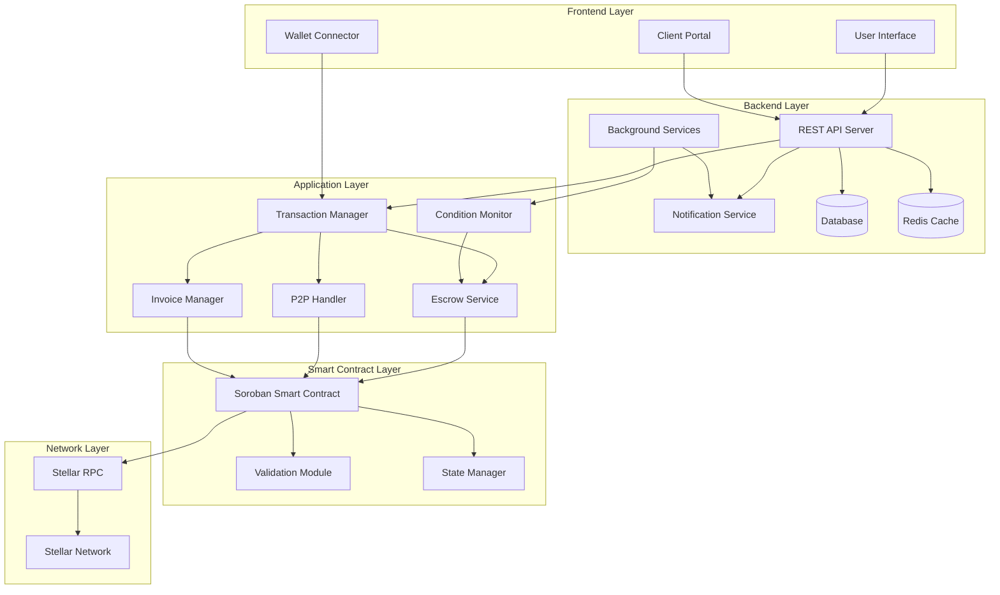

# Design Document: Stellar Smart Contract DApp

## Overview

The Stellar Smart Contract DApp is a comprehensive transaction management system built on the Stellar blockchain. It provides four core transaction types: basic transactions, escrow services, peer-to-peer payments, and invoice management. The system leverages Stellar's native smart contract capabilities (Soroban) to ensure secure, transparent, and efficient transaction processing.

The architecture follows a modular design with clear separation between the frontend interface, transaction management layer, smart contract logic, and Stellar network integration. This design ensures scalability, maintainability, and security while providing a seamless user experience.

## Architecture

The system follows a layered architecture pattern with both frontend and backend components:



**Layer Responsibilities:**

- **Frontend Layer**: User interface, wallet integration, and client invoice portal
- **Backend Layer**: API services, notifications, background processing, and data persistence
- **Application Layer**: Business logic and transaction orchestration
- **Smart Contract Layer**: On-chain logic, validation, and state management
- **Network Layer**: Stellar blockchain interaction and RPC communication

## Components and Interfaces

### Backend API Server

The central backend service providing REST endpoints for frontend and client portal interactions.

```typescript
interface BackendAPI {
  // User management
  createUser(walletAddress: string, email?: string): Promise<User>
  getUserProfile(userId: string): Promise<UserProfile>
  updateUserProfile(userId: string, profile: Partial<UserProfile>): Promise<UserProfile>
  
  // Invoice management
  createInvoice(params: CreateInvoiceRequest): Promise<Invoice>
  getInvoice(invoiceId: string): Promise<Invoice>
  approveInvoice(invoiceId: string, clientSignature: string): Promise<ApprovalResult>
  rejectInvoice(invoiceId: string, reason?: string): Promise<RejectionResult>
  getInvoicesByUser(userId: string, filters?: InvoiceFilters): Promise<Invoice[]>
  
  // Transaction history
  getTransactionHistory(userId: string, filters?: TransactionFilters): Promise<Transaction[]>
  getTransactionDetails(txHash: string): Promise<TransactionDetails>
  
  // Escrow monitoring
  getActiveEscrows(userId: string): Promise<EscrowContract[]>
  checkEscrowConditions(escrowId: string): Promise<ConditionStatus[]>
  
  // Notifications
  getNotifications(userId: string): Promise<Notification[]>
  markNotificationRead(notificationId: string): Promise<void>
}
```

### Notification Service

Handles email, SMS, and push notifications for invoice delivery and transaction updates.

```typescript
interface NotificationService {
  // Invoice notifications
  sendInvoiceToClient(invoice: Invoice, clientEmail: string): Promise<NotificationResult>
  notifyInvoiceApproval(invoiceId: string, creatorId: string): Promise<NotificationResult>
  notifyInvoiceRejection(invoiceId: string, creatorId: string, reason?: string): Promise<NotificationResult>
  
  // Transaction notifications
  notifyTransactionComplete(txHash: string, userId: string): Promise<NotificationResult>
  notifyEscrowRelease(escrowId: string, userId: string): Promise<NotificationResult>
  notifyEscrowRefund(escrowId: string, userId: string): Promise<NotificationResult>
  
  // System notifications
  sendSystemAlert(userId: string, alert: SystemAlert): Promise<NotificationResult>
  
  // Template management
  getNotificationTemplate(type: NotificationType): Promise<NotificationTemplate>
  updateNotificationTemplate(type: NotificationType, template: NotificationTemplate): Promise<void>
}
```

### Background Services

Automated services for monitoring conditions and processing scheduled tasks.

```typescript
interface BackgroundServices {
  // Condition monitoring
  startConditionMonitor(escrowId: string): Promise<void>
  stopConditionMonitor(escrowId: string): Promise<void>
  checkAllActiveConditions(): Promise<ConditionCheckResult[]>
  
  // Invoice expiration
  processExpiredInvoices(): Promise<ExpirationResult[]>
  scheduleInvoiceExpiration(invoiceId: string, expirationDate: Date): Promise<void>
  
  // Transaction status updates
  syncTransactionStatuses(): Promise<SyncResult>
  updateTransactionStatus(txHash: string): Promise<TransactionStatus>
  
  // Cleanup tasks
  cleanupExpiredSessions(): Promise<void>
  archiveOldTransactions(olderThan: Date): Promise<ArchiveResult>
}
```

### Database Models

Data persistence layer for user data, invoices, and transaction history.

```typescript
interface DatabaseModels {
  // User management
  User: {
    id: string
    walletAddress: string
    email?: string
    createdAt: Date
    updatedAt: Date
    preferences: UserPreferences
  }
  
  // Invoice storage
  InvoiceRecord: {
    id: string
    creatorId: string
    clientEmail: string
    amount: number
    description: string
    status: InvoiceStatus
    createdAt: Date
    dueDate: Date
    approvedAt?: Date
    executedAt?: Date
    txHash?: string
    approvalToken: string
    metadata: Record<string, any>
  }
  
  // Transaction history
  TransactionRecord: {
    id: string
    userId: string
    type: TransactionType
    txHash: string
    status: TransactionStatus
    amount: number
    sender: string
    recipient: string
    timestamp: Date
    blockHeight?: number
    fees: number
    metadata: Record<string, any>
  }
  
  // Escrow tracking
  EscrowRecord: {
    id: string
    contractId: string
    creatorId: string
    recipientId?: string
    amount: number
    status: EscrowStatus
    conditions: Condition[]
    createdAt: Date
    expiresAt: Date
    releasedAt?: Date
    txHash?: string
  }
  
  // Notifications
  NotificationRecord: {
    id: string
    userId: string
    type: NotificationType
    title: string
    message: string
    read: boolean
    createdAt: Date
    metadata: Record<string, any>
  }
}
```

### Client Portal Interface

Dedicated interface for invoice clients to view and approve invoices.

```typescript
interface ClientPortal {
  // Invoice viewing
  getInvoiceByToken(approvalToken: string): Promise<PublicInvoice>
  validateInvoiceToken(token: string): Promise<TokenValidation>
  
  // Approval process
  approveInvoice(token: string, clientInfo: ClientInfo): Promise<ApprovalResult>
  rejectInvoice(token: string, reason: string, clientInfo: ClientInfo): Promise<RejectionResult>
  
  // Client information
  submitClientDetails(token: string, details: ClientDetails): Promise<void>
  getApprovalHistory(clientEmail: string): Promise<ApprovalHistory[]>
}

interface PublicInvoice {
  id: string
  amount: number
  description: string
  creatorName: string
  dueDate: Date
  status: InvoiceStatus
  // Sensitive information excluded
}
```
```

### Transaction Manager

The central orchestrator for all transaction types, providing a unified interface for the frontend and backend.

```typescript
interface TransactionManager {
  // Core transaction operations
  createBasicTransaction(sender: string, recipient: string, amount: number): Promise<TransactionResult>
  createEscrowTransaction(params: EscrowParams): Promise<EscrowResult>
  createP2PTransaction(sender: string, recipient: string, amount: number): Promise<TransactionResult>
  createInvoice(params: InvoiceParams): Promise<InvoiceResult>
  
  // Status and history
  getTransactionStatus(txHash: string): Promise<TransactionStatus>
  getTransactionHistory(accountId: string): Promise<Transaction[]>
  
  // Validation
  validateAddress(address: string): Promise<boolean>
  validateBalance(accountId: string, amount: number): Promise<boolean>
  
  // Backend integration
  persistTransaction(transaction: Transaction): Promise<void>
  updateTransactionStatus(txHash: string, status: TransactionStatus): Promise<void>
}

### Escrow Service

Manages conditional transactions with automated release mechanisms and backend monitoring.

```typescript
interface EscrowService {
  createEscrow(sender: string, recipient: string, amount: number, conditions: Condition[]): Promise<EscrowContract>
  checkConditions(escrowId: string): Promise<ConditionStatus[]>
  releaseEscrow(escrowId: string): Promise<TransactionResult>
  refundEscrow(escrowId: string): Promise<TransactionResult>
  getEscrowDetails(escrowId: string): Promise<EscrowDetails>
  
  // Backend integration
  scheduleConditionCheck(escrowId: string, checkInterval: number): Promise<void>
  notifyEscrowStatusChange(escrowId: string, status: EscrowStatus): Promise<void>
}

interface Condition {
  type: 'time_based' | 'oracle_based' | 'manual_approval'
  parameters: Record<string, any>
  validator: string // Contract address or function
}

interface ConditionMonitor {
  startMonitoring(escrowId: string, conditions: Condition[]): Promise<void>
  stopMonitoring(escrowId: string): Promise<void>
  checkCondition(condition: Condition): Promise<boolean>
  scheduleCheck(escrowId: string, nextCheck: Date): Promise<void>
}
```

### P2P Handler

Processes direct peer-to-peer transactions with minimal overhead.

```typescript
interface P2PHandler {
  sendPayment(sender: string, recipient: string, amount: number, memo?: string): Promise<TransactionResult>
  validateRecipient(address: string): Promise<RecipientValidation>
  estimateFees(amount: number): Promise<FeeEstimate>
  getPaymentHistory(accountId: string): Promise<P2PTransaction[]>
}
```

### Invoice Manager

Handles invoice creation, approval workflows, automated execution, and client communication.

```typescript
interface InvoiceManager {
  createInvoice(creator: string, client: string, amount: number, description: string, dueDate: Date): Promise<Invoice>
  sendInvoice(invoiceId: string): Promise<InvoiceDelivery>
  approveInvoice(invoiceId: string, clientSignature: string): Promise<ApprovalResult>
  executeInvoice(invoiceId: string): Promise<TransactionResult>
  getInvoiceStatus(invoiceId: string): Promise<InvoiceStatus>
  
  // Backend integration
  generateApprovalToken(invoiceId: string): Promise<string>
  validateApprovalToken(token: string): Promise<TokenValidation>
  scheduleInvoiceExpiration(invoiceId: string, expirationDate: Date): Promise<void>
  notifyInvoiceStatusChange(invoiceId: string, status: InvoiceStatus): Promise<void>
}

interface InvoiceDelivery {
  invoiceId: string
  clientEmail: string
  approvalUrl: string
  deliveryStatus: 'sent' | 'delivered' | 'failed'
  sentAt: Date
  expiresAt: Date
}
```

### Smart Contract Interface

The Soroban smart contract providing on-chain transaction logic.

```rust
// Soroban contract interface (Rust-like pseudocode)
pub trait StellarDAppContract {
    // Basic transactions
    fn execute_transaction(sender: Address, recipient: Address, amount: i128) -> Result<(), Error>;
    
    // Escrow operations
    fn create_escrow(sender: Address, recipient: Address, amount: i128, conditions: Vec<Condition>) -> Result<u64, Error>;
    fn check_escrow_conditions(escrow_id: u64) -> Result<bool, Error>;
    fn release_escrow(escrow_id: u64) -> Result<(), Error>;
    fn refund_escrow(escrow_id: u64) -> Result<(), Error>;
    
    // Invoice operations
    fn create_invoice(creator: Address, client: Address, amount: i128, metadata: String) -> Result<u64, Error>;
    fn approve_invoice(invoice_id: u64, client_signature: Signature) -> Result<(), Error>;
    fn execute_invoice(invoice_id: u64) -> Result<(), Error>;
    
    // Validation and queries
    fn validate_balance(account: Address, amount: i128) -> Result<bool, Error>;
    fn get_transaction_history(account: Address) -> Result<Vec<Transaction>, Error>;
}
```

### Data Models

### Core Transaction Types

```typescript
interface Transaction {
  id: string
  type: 'basic' | 'escrow' | 'p2p' | 'invoice'
  sender: string
  recipient: string
  amount: number
  status: TransactionStatus
  timestamp: Date
  txHash?: string
  metadata?: Record<string, any>
}

enum TransactionStatus {
  PENDING = 'pending',
  CONFIRMED = 'confirmed',
  FAILED = 'failed',
  CANCELLED = 'cancelled'
}
```

### Backend-Specific Models

```typescript
interface User {
  id: string
  walletAddress: string
  email?: string
  displayName?: string
  createdAt: Date
  updatedAt: Date
  preferences: UserPreferences
  notificationSettings: NotificationSettings
}

interface UserPreferences {
  currency: string
  timezone: string
  language: string
  emailNotifications: boolean
  pushNotifications: boolean
}

interface NotificationSettings {
  invoiceUpdates: boolean
  transactionConfirmations: boolean
  escrowUpdates: boolean
  systemAlerts: boolean
}

interface Notification {
  id: string
  userId: string
  type: NotificationType
  title: string
  message: string
  read: boolean
  createdAt: Date
  actionUrl?: string
  metadata: Record<string, any>
}

enum NotificationType {
  INVOICE_RECEIVED = 'invoice_received',
  INVOICE_APPROVED = 'invoice_approved',
  INVOICE_REJECTED = 'invoice_rejected',
  TRANSACTION_CONFIRMED = 'transaction_confirmed',
  ESCROW_RELEASED = 'escrow_released',
  ESCROW_REFUNDED = 'escrow_refunded',
  SYSTEM_ALERT = 'system_alert'
}
```

### Escrow Models

```typescript
interface EscrowContract {
  id: string
  sender: string
  recipient: string
  amount: number
  conditions: Condition[]
  status: EscrowStatus
  createdAt: Date
  expiresAt: Date
  contractAddress: string
}

enum EscrowStatus {
  ACTIVE = 'active',
  CONDITIONS_MET = 'conditions_met',
  RELEASED = 'released',
  REFUNDED = 'refunded',
  EXPIRED = 'expired'
}

interface ConditionStatus {
  condition: Condition
  met: boolean
  checkedAt: Date
  evidence?: string
}
```

### Invoice Models

```typescript
interface Invoice {
  id: string
  creator: string
  clientEmail: string
  amount: number
  description: string
  status: InvoiceStatus
  createdAt: Date
  dueDate: Date
  approvedAt?: Date
  executedAt?: Date
  txHash?: string
  approvalToken: string
  clientInfo?: ClientInfo
}

enum InvoiceStatus {
  DRAFT = 'draft',
  SENT = 'sent',
  APPROVED = 'approved',
  EXECUTED = 'executed',
  REJECTED = 'rejected',
  EXPIRED = 'expired'
}

interface ClientInfo {
  name?: string
  email: string
  walletAddress?: string
  approvalTimestamp: Date
  ipAddress: string
  userAgent: string
}

interface ApprovalResult {
  invoiceId: string
  approved: boolean
  clientInfo: ClientInfo
  approvalToken: string
  timestamp: Date
}
```

### Wallet Integration Models

```typescript
interface WalletConnection {
  accountId: string
  publicKey: string
  network: 'testnet' | 'mainnet'
  connected: boolean
  walletType: 'freighter' | 'albedo' | 'rabet' | 'walletconnect'
}

interface SignatureRequest {
  transaction: string // XDR encoded transaction
  accountId: string
  network: string
  metadata?: {
    description: string
    amount?: number
    recipient?: string
  }
}
```

## Correctness Properties

*A property is a characteristic or behavior that should hold true across all valid executions of a system—essentially, a formal statement about what the system should do. Properties serve as the bridge between human-readable specifications and machine-verifiable correctness guarantees.*

Before defining the correctness properties, let me analyze the acceptance criteria to determine which are testable as properties.

### Core Transaction Properties

**Property 1: Transaction Creation Completeness**
*For any* valid transaction request with sufficient funds and valid addresses, the Transaction_System should create a transaction and return a valid transaction hash for tracking.
**Validates: Requirements 1.1, 1.2**

**Property 2: Balance Validation Consistency**
*For any* transaction attempt where the sender has insufficient funds, the system should reject the transaction and return an appropriate error message, regardless of transaction type (basic, escrow, P2P, invoice).
**Validates: Requirements 1.3, 2.5, 5.2**

**Property 3: Address Validation Universality**
*For any* address used in the system (recipient, sender, wallet connection), the system should validate the address format and Stellar network existence before processing.
**Validates: Requirements 1.5, 3.2, 6.3**

**Property 4: Status Update Consistency**
*For any* transaction that receives network confirmation, the system should update the transaction status to reflect the current network state in real-time.
**Validates: Requirements 1.4, 7.3**

### Escrow Properties

**Property 5: Escrow Fund Locking**
*For any* escrow creation with valid parameters, the Escrow_Service should lock the specified funds in a smart contract and prevent access until conditions are met or timeout occurs.
**Validates: Requirements 2.1**

**Property 6: Condition-Based Release**
*For any* escrow where all conditions are verified as met, the Escrow_Service should automatically release funds to the recipient without requiring additional user intervention.
**Validates: Requirements 2.2**

**Property 7: Timeout Refund Mechanism**
*For any* escrow where conditions are not met within the specified timeout period, the Escrow_Service should automatically return funds to the original sender.
**Validates: Requirements 2.3**

**Property 8: Condition Verification Completeness**
*For any* escrow condition check, the Escrow_Service should verify each condition against its predefined criteria and return accurate status for all conditions.
**Validates: Requirements 2.6**

### P2P and Invoice Properties

**Property 9: P2P Payment Processing**
*For any* P2P payment with valid parameters, the P2P_Handler should process the direct transfer and complete the transaction on the Stellar network.
**Validates: Requirements 3.1**

**Property 10: Invoice Approval Workflow**
*For any* approved invoice, the Invoice_Manager should automatically execute the payment transaction without requiring additional user intervention.
**Validates: Requirements 4.3**

**Property 11: Invoice Expiration Handling**
*For any* invoice that reaches its due date without approval, the Invoice_Manager should mark it as expired and prevent further processing.
**Validates: Requirements 4.6**

### System-Wide Properties

**Property 12: Unique Identifier Generation**
*For any* created entity (escrow, invoice, transaction), the system should generate a unique identifier that distinguishes it from all other entities of the same type.
**Validates: Requirements 2.4, 4.1**

**Property 13: Positive Amount Validation**
*For any* financial operation (P2P payment, invoice creation, escrow creation), the system should validate that amounts are positive values within acceptable network limits.
**Validates: Requirements 3.4, 4.5**

**Property 14: Notification Consistency**
*For any* significant transaction event (successful payment, invoice rejection, escrow release), the system should notify all relevant parties with appropriate details.
**Validates: Requirements 3.3, 4.4**

**Property 15: Comprehensive Error Handling**
*For any* error condition (network failure, validation failure, contract execution failure), the system should provide specific error details and appropriate recovery suggestions while maintaining system security.
**Validates: Requirements 3.5, 5.4, 8.1, 8.2, 8.3**

### Security Properties

**Property 16: Signature Validation**
*For any* transaction submitted to the Smart_Contract, all signatures should be validated before execution to ensure transaction authenticity.
**Validates: Requirements 5.1**

**Property 17: Reentrancy Protection**
*For any* fund transfer operation, the Smart_Contract should prevent reentrancy attacks and maintain consistent state throughout the transaction.
**Validates: Requirements 5.3**

**Property 18: Audit Trail Completeness**
*For any* transaction attempt (successful or failed), the Smart_Contract should create audit logs while protecting user privacy.
**Validates: Requirements 5.5, 8.5**

### Wallet Integration Properties

**Property 19: Secure Wallet Connection**
*For any* wallet connection attempt, the User_Wallet should establish a secure connection and validate the account before allowing access to DApp functionality.
**Validates: Requirements 6.1**

**Property 20: Authorization Prompt Consistency**
*For any* transaction requiring user signature, the User_Wallet should prompt for authorization and display complete transaction details before requesting approval.
**Validates: Requirements 6.2, 6.5**

**Property 21: Session Cleanup**
*For any* wallet disconnection, the User_Wallet should clear all session data and prevent unauthorized access to user accounts.
**Validates: Requirements 6.4**

### Data Management Properties

**Property 22: Transaction History Completeness**
*For any* user account, the Transaction_System should return all transactions associated with that account when history is requested.
**Validates: Requirements 7.1**

**Property 23: Transaction Detail Display**
*For any* transaction displayed to the user, the system should show all required fields (type, amount, status, timestamp) in a consistent format.
**Validates: Requirements 7.2**

**Property 24: Filtering Functionality**
*For any* transaction history filter request (by type, date range, or status), the Transaction_System should return only transactions matching the specified criteria.
**Validates: Requirements 7.4**

**Property 25: Data Persistence**
*For any* user session, the Transaction_System should persist transaction history and maintain data consistency across session boundaries.
**Validates: Requirements 7.5**

**Property 26: Automatic Retry Mechanism**
*For any* temporary network failure, the DApp should implement automatic retry with exponential backoff while providing user feedback about retry attempts.
**Validates: Requirements 8.4**

## Technology Stack

### Frontend Technologies
- **Framework**: React with TypeScript for type safety and component reusability
- **Wallet Integration**: Stellar SDK with support for Freighter, Albedo, and WalletConnect
- **State Management**: Redux Toolkit for predictable state management
- **UI Components**: Material-UI or Tailwind CSS for consistent design
- **Build Tool**: Vite for fast development and optimized builds

### Backend Technologies
- **Runtime**: Node.js with Express.js for REST API server
- **Language**: TypeScript for type safety across the stack
- **Database**: PostgreSQL for relational data with Redis for caching
- **ORM**: Prisma for type-safe database operations
- **Authentication**: JWT tokens with wallet signature verification
- **Queue System**: Bull Queue with Redis for background job processing

### Smart Contract Technologies
- **Platform**: Stellar Soroban smart contracts
- **Language**: Rust for high-performance contract logic
- **Testing**: Soroban CLI and custom test framework
- **Deployment**: Stellar testnet and mainnet deployment scripts

### Infrastructure Technologies
- **Containerization**: Docker for consistent deployment environments
- **Orchestration**: Docker Compose for local development
- **Monitoring**: Prometheus and Grafana for system metrics
- **Logging**: Winston for structured logging
- **Email Service**: SendGrid or AWS SES for invoice notifications

### Development Tools
- **Version Control**: Git with conventional commit messages
- **CI/CD**: GitHub Actions for automated testing and deployment
- **Code Quality**: ESLint, Prettier, and Husky for code standards
- **Testing**: Jest for unit tests, Cypress for E2E testing
- **Documentation**: OpenAPI/Swagger for API documentation

## Security Considerations

### Smart Contract Security
- **Reentrancy Protection**: Implement checks-effects-interactions pattern
- **Access Control**: Role-based permissions for administrative functions
- **Input Validation**: Comprehensive validation of all contract inputs
- **Upgrade Mechanism**: Proxy pattern for contract upgrades if needed
- **Audit Requirements**: Third-party security audit before mainnet deployment

### Backend Security
- **Authentication**: Multi-factor authentication with wallet signatures
- **Authorization**: Role-based access control (RBAC) for API endpoints
- **Data Encryption**: AES-256 encryption for sensitive data at rest
- **Transport Security**: TLS 1.3 for all API communications
- **Rate Limiting**: API rate limiting to prevent abuse
- **Input Sanitization**: Comprehensive input validation and sanitization

### Frontend Security
- **Content Security Policy**: Strict CSP headers to prevent XSS attacks
- **Wallet Security**: Secure wallet connection handling
- **Session Management**: Secure session handling with automatic expiration
- **Data Validation**: Client-side validation with server-side verification
- **Dependency Security**: Regular security audits of npm dependencies

### Infrastructure Security
- **Network Security**: VPC with private subnets for database access
- **Secrets Management**: AWS Secrets Manager or HashiCorp Vault
- **Backup Strategy**: Automated encrypted backups with point-in-time recovery
- **Monitoring**: Real-time security monitoring and alerting
- **Compliance**: GDPR compliance for user data handling

## Deployment Architecture

### Development Environment
- **Local Setup**: Docker Compose with all services
- **Database**: PostgreSQL and Redis containers
- **Stellar Network**: Local Stellar network or testnet connection
- **Hot Reload**: Development servers with hot module replacement

### Staging Environment
- **Infrastructure**: AWS ECS or similar container orchestration
- **Database**: Managed PostgreSQL (AWS RDS) with read replicas
- **Caching**: Managed Redis (AWS ElastiCache)
- **Load Balancing**: Application Load Balancer with SSL termination
- **Monitoring**: CloudWatch logs and metrics

### Production Environment
- **High Availability**: Multi-AZ deployment with auto-scaling
- **Database**: Production-grade PostgreSQL with automated backups
- **CDN**: CloudFront for static asset delivery
- **Security**: WAF protection and DDoS mitigation
- **Monitoring**: Comprehensive monitoring with alerting

## Error Handling

The system implements comprehensive error handling across all layers:

### Network Layer Errors
- **Connection Failures**: Automatic retry with exponential backoff
- **Timeout Errors**: Clear messaging with retry options
- **RPC Errors**: Specific error code translation to user-friendly messages

### Smart Contract Errors
- **Validation Failures**: Detailed validation rule violation messages
- **Execution Failures**: Contract-specific error messages with recovery suggestions
- **State Conflicts**: Automatic state reversion with conflict resolution guidance

### Application Layer Errors
- **Insufficient Funds**: Balance-specific error messages with funding suggestions
- **Invalid Addresses**: Address format validation with correction hints
- **Permission Errors**: Clear authorization requirement messages

### User Interface Errors
- **Wallet Connection Issues**: Step-by-step connection troubleshooting
- **Transaction Signing Failures**: Signature requirement clarification
- **Network Selection Errors**: Network compatibility guidance

## Testing Strategy

The testing approach combines unit testing for specific scenarios with property-based testing for comprehensive coverage:

### Unit Testing Approach
- **Component Integration**: Test interactions between application layer components
- **Edge Cases**: Test boundary conditions and error scenarios
- **Specific Examples**: Test known good and bad transaction examples
- **Mock Integration**: Test with mocked Stellar network responses

### Property-Based Testing Configuration
- **Testing Library**: Use fast-check for TypeScript/JavaScript components and proptest for Rust smart contracts
- **Test Iterations**: Minimum 100 iterations per property test to ensure comprehensive input coverage
- **Generator Strategy**: Custom generators for Stellar addresses, transaction amounts, and contract states
- **Shrinking**: Automatic test case minimization when failures occur

### Property Test Implementation
Each correctness property will be implemented as a property-based test with the following structure:
- **Test Tag Format**: `Feature: stellar-smart-contract-dapp, Property {number}: {property_text}`
- **Input Generation**: Random but valid inputs for comprehensive coverage
- **Assertion Logic**: Direct validation of the property statement
- **Failure Analysis**: Detailed logging of counterexamples for debugging

### Integration Testing
- **End-to-End Flows**: Complete transaction workflows from wallet connection to confirmation
- **Cross-Component Testing**: Verify proper interaction between Transaction Manager and specialized handlers
- **Network Integration**: Test against Stellar testnet for realistic network behavior
- **Error Recovery**: Test system behavior during various failure scenarios

### Performance Testing
- **Transaction Throughput**: Measure system performance under load
- **Memory Usage**: Monitor resource consumption during extended operation
- **Network Efficiency**: Optimize RPC calls and batch operations where possible